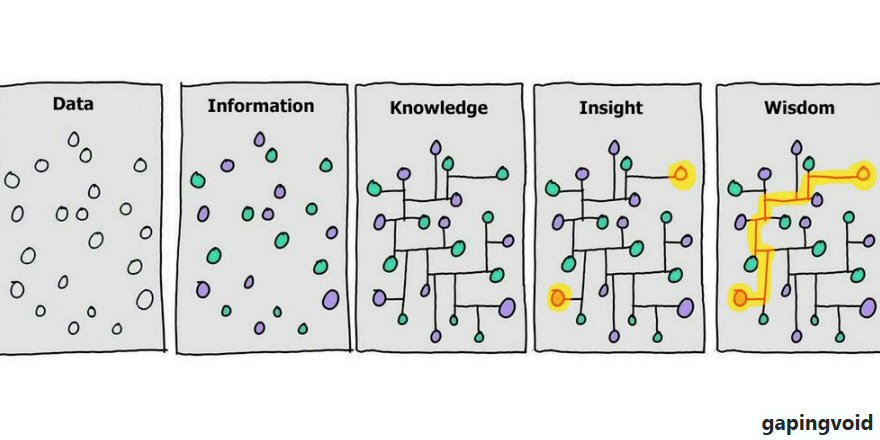
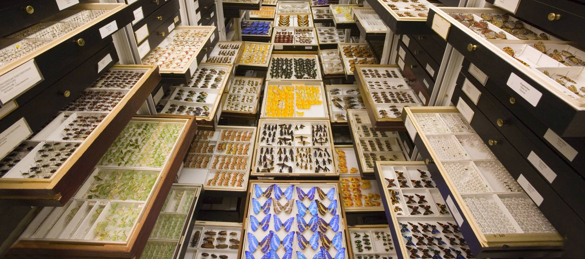
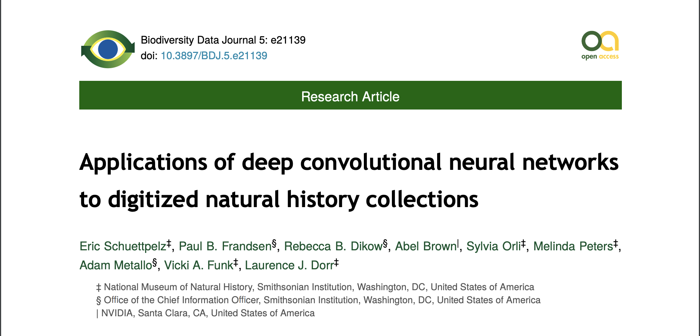
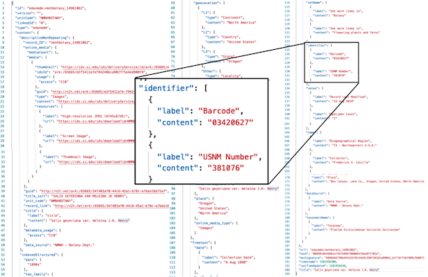
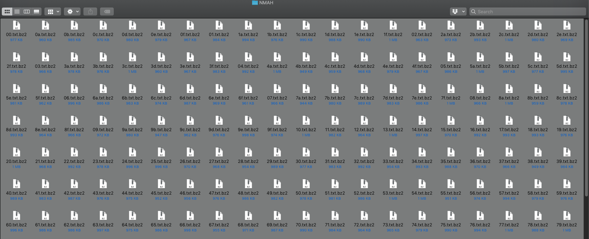
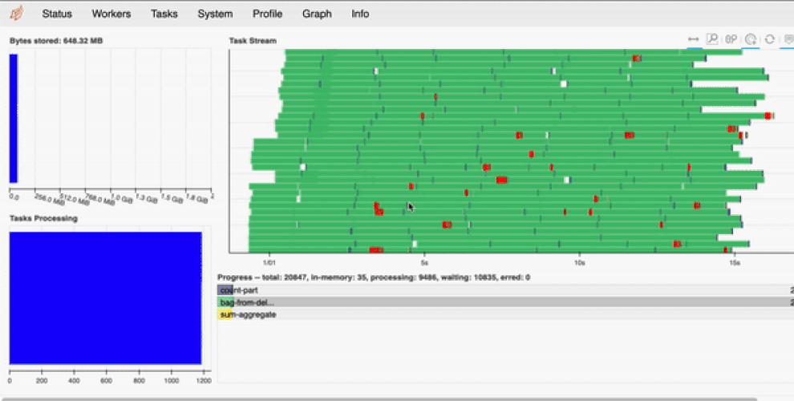
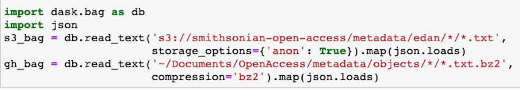
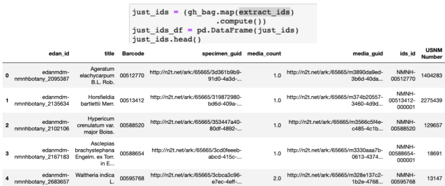
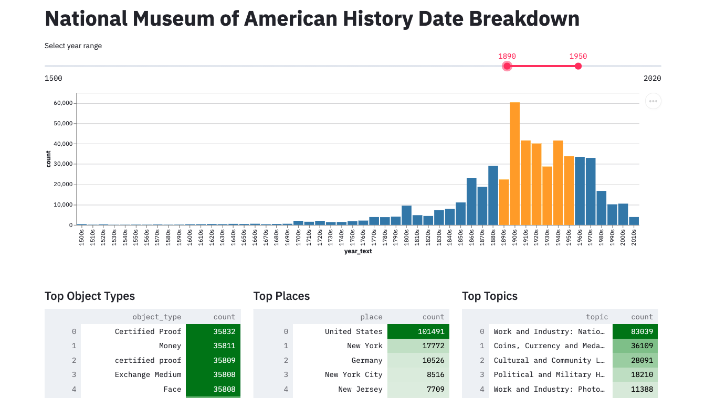
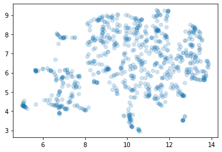

## Making Smithsonian Open Access Accessible with Python and Dask

**Mike Trizna**

Smithsonian OCIO Data Science Lab

May 4, 2021 | *csv,conf,v6*

---

## What is the Smithsonian Institution?

Yes, there are the museums (19 of them, mostly in Washington, DC), but we also have 21 libraries and archives, 9 research centers ... and a zoo.

---

## Smithsonian Mission

Founded in 1846 from the bequest of Englishman James Smithson with the condition: 
> "under the name of the Smithsonian Institution, an establishment for the **increase and diffusion of knowledge**."

---

The Smithsonian has been increasing and diffusing *Knowledge* since 1846, but what about all of that *Data*?

---

All of that *data* and *info* that fed into *knowledge, insight, and wisdom* were dutifully cataloged and stored.

---
## Launch Event

February 25, 2020

---

## SI Open Access Release

Of the Smithsonian’s 155 million objects, 2.1 million library volumes and 156,000 cubic feet of archival collections:

* 2.8 million 2-D and 3-D images
* Over 17 million collection metadata objects

---

## Terms of Use

Before February 2020, all Smithsonian museums and units made their data searchable and sometimes able to download,
but through each individual unit. Many different use agreements.

SI Open Access put all media and metadata in one place, and all Open Access media is CC0.

---

## So how can all of this data be accessed?

I will cover 3 different ways.

All 3 share metadata records in the same deeply-nested JSON structure.

---

## Web API

🔗: http://edan.si.edu/openaccess/apidocs/

* API Key needed (but free and painless to register)
* Great for getting a feel for record structure

---

## However you will quickly run into limitations

* Records are extensively indexed, but can only search indexed fields.
* Row limit of 1000 per API call

---

## Example: Herbarium Sheet mercury detector

2017 paper that described building a machine learning model to detect herbarium sheets that had been stained with mercury.

https://doi.org/10.3897/bdj.5.e21139

---

### Example: Herbarium Sheet mercury detector

I wanted to create a new model on same dataset (2017 is ancient history in Machine Learning)

All training images are shared on Figshare, but photos are resized and I wanted original metadata

---

### Example: Herbarium Sheet mercury detector

Unfortunately the "barcode" term from the supplementary materials is not an indexed field.

---

## Full dataset sources: GitHub and AWS

* [AWS S3](https://registry.opendata.aws/smithsonian-open-access/) for all metadata and images
* [GitHub](https://github.com/smithsonian/openaccess) for versioned metadata

---

## How it's packaged

* Files are serialized as line-delimited JSON and compressed with bzip2.
* Directories are organized by owning unit and files are distributed by first two characters of content serialization hash. 

---

## How it's packaged

---

## Bummer, we need to go through every single file one at a time?

If I'm looking across all units, that's 9,728 files to process!

---

### But there's actually a benefit to so many files to process

## We can multitask!

---

## Enter Dask

https://dask.org/

---

## What is Dask?

Dask lets you set up a mini cluster on your machine ... or on an actual compute cluster

---

## Dask Dashboard

---

## What is Dask?

Dask is more well-known for parallel processing of DataFrames, but it also contains a really useful catch-all "Bag" type.

---

### Example: Herbarium Sheet mercury detector

---

### Digital Humanities Internship Project

#### Patrick McManus from George Mason University

---

### Example: Semantic Clustering American Art Paintings

Full interactive notebook (through Binder) available at https://github.com/sidatasciencelab/siopenaccess.

---

## Questions?

---

